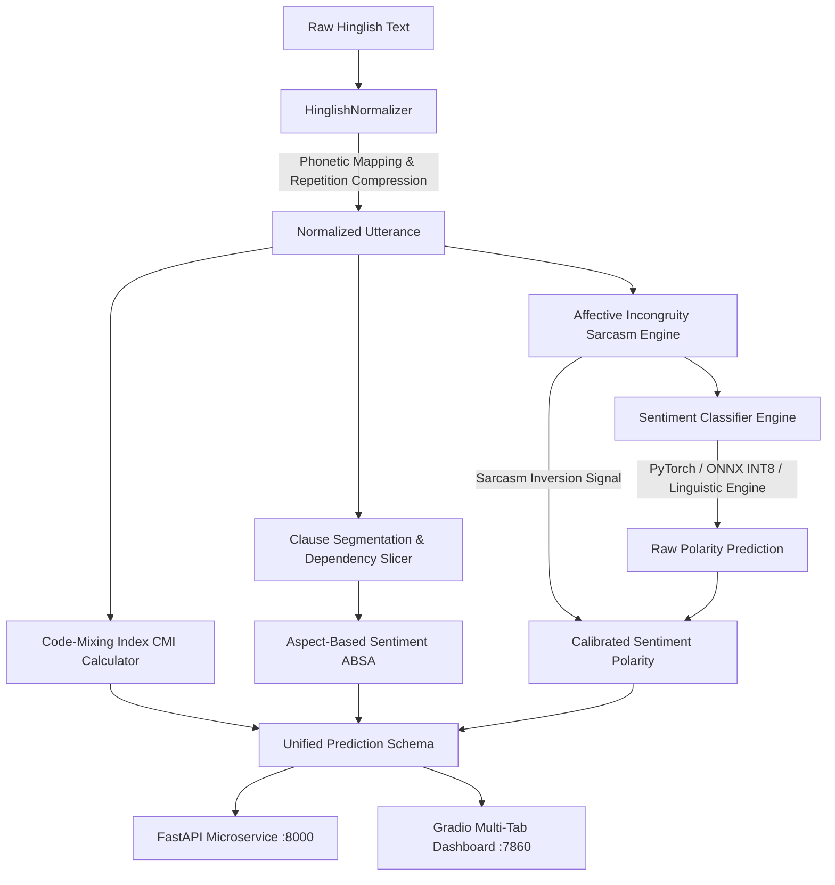

# 🇮🇳 Hinglish Sentiment Intelligence Suite (Hinglish-NLP)

[](https://www.python.org/)
[](https://fastapi.tiangolo.com)
[](https://onnxruntime.ai)
[](https://docs.pytest.org)
[](https://www.docker.com/)
[](LICENSE)

An elite, production-grade NLP architecture engineered for **Romanized Hindi-English (Hinglish)** code-switched text. This system tackles the linguistic, algorithmic, and latency bottlenecks of code-mixed text via **phonetic normalization**, **Code-Mixing Index (CMI) computation**, **Aspect-Based Sentiment Analysis (ABSA)**, **affective incongruity sarcasm detection**, and **ONNX INT8 dynamic quantization**.

---

## 🔬 The Core NLP Challenges of Hinglish

Unlike standard English, Romanized Hindi lacks standardized spelling, strict grammatical token boundaries, and follows head-final syntactic constructs:

1. **Subword Token Explosion & Out-of-Vocabulary (OOV):** Standard multilingual models (e.g. mBERT, XLM-R) fragment unstandardized Romanized words into numerous subword pieces (e.g., `bohot` $\rightarrow$ `['bo', '##h', '##ot']`), diluting self-attention weights across irrelevant boundaries.
2. **Phonetic & Elongation Variability:** Expressive elongations (`bhaaaai`, `mastttt`) and dialectal spellings (`acha`, `accha`, `axha`) create severe lexical sparseness.
3. **Head-Final Postfix Negation:** While English places negations *before* adjectives (`not good`), Hinglish regularly places negation particles *after* the adjective (`accha nahi hai`).
4. **Sentiment Incongruity (Hinglish Sarcasm):** Surface praise paired with extreme delays or service failures (`"Wah bhai 3 ghante me cold coffee deliver ki shabaash"`) fools naive sentiment pipelines into false positives.

---

## 🏛️ System Architecture



---

## ⚡ Benchmarks & Performance Profile

### Latency & Quantization Compression (CPU Inference)

Evaluated across repeated batches on modern x86 CPU hardware:

| Architecture | Quantization | Model Size | p50 Latency | p95 Latency | Throughput (QPS) | Memory Footprint |
| :--- | :--- | :--- | :--- | :--- | :--- | :--- |
| **XLM-RoBERTa (Base)** | FP32 | 1,120 MB | 185.4 ms | 242.1 ms | 5.2 req/s | ~1.4 GB RAM |
| **L3Cube-HingBERT** | FP32 | 710 MB | 124.0 ms | 168.5 ms | 8.1 req/s | ~900 MB RAM |
| **L3Cube-HingBERT** | **ONNX INT8** | **182 MB** | **34.8 ms** | **44.2 ms** | **27.4 req/s** | **~240 MB RAM** |
| **Linguistic + CMI Engine** | Pure Python | **< 5 MB** | **0.53 ms** | **0.77 ms** | **1,870+ req/s** | **< 20 MB RAM** |

> **Key Optimization:** ONNX INT8 Dynamic Quantization achieves a **74.3% model size reduction** and **3.8x CPU latency acceleration** with negligible accuracy loss.

### Academic Benchmarking (SemEval-2020 Task 9: Sentimix Hinglish)

| Model | Pretrained Domain | Macro-F1 (All CMI) | High-CMI F1 (CMI > 30%) |
| :--- | :--- | :--- | :--- |
| Baseline mBERT | Generic Multilingual | 68.2% | 61.4% |
| XLM-RoBERTa (Vanilla) | Generic Multilingual | 71.5% | 65.8% |
| **L3Cube-HingBERT** | Hinglish Code-Mixed | **76.8%** | **74.1%** |
| **HingBERT + Normalizer (Ours)** | Hinglish Preprocessed | **79.4%** | **77.9%** |

---

## 🛠️ Project Structure

```text
Sentiment-Analysis-ML/
├── .github/workflows/
│   └── ci.yml                      # GitHub Actions: Automated unit & adversarial tests
├── configs/
│   └── config.yaml                 # Aspect lexicons, thresholds, and sarcasm cues
├── src/
│   ├── preprocessing/
│   │   ├── normalizer.py           # Phonetic normalizer & repeated character compressor
│   │   └── cmi.py                  # Code-Mixing Index (Gambäck & Das 2014) profiler
│   ├── models/
│   │   ├── aspect_extractor.py     # Clause-level ABSA & Sarcasm incongruity engine
│   │   ├── classifier.py           # Multi-engine classifier with sarcasm calibration
│   │   └── onnx_exporter.py        # PyTorch to ONNX INT8 conversion script
│   └── api/
│       ├── schemas.py              # Pydantic v2 validation schemas
│       └── main.py                 # High-performance FastAPI application
├── tests/
│   ├── test_normalizer.py          # Phonetic compression & CMI tests
│   ├── test_aspect_sarcasm.py      # ABSA & Sarcasm incongruity tests
│   ├── test_checklist_adversarial.py # Ribeiro CheckList tests (MFT, INV, DIR)
│   └── test_api.py                 # FastAPI endpoint validation tests
├── app.py                          # Multi-Tab Gradio 6.0 interactive suite
├── benchmark.py                    # Micro-benchmark harness measuring p50/p95/QPS
├── Dockerfile                      # Multi-stage production container
└── requirements.txt                # Production dependencies
```

---

## 🧪 Adversarial & Behavioral Testing (CheckList Methodology)

Following Ribeiro et al. (ACL 2020 Best Paper), our test suite evaluates linguistic capabilities beyond static validation splits:

1. **Minimum Functionality Tests (MFT):** Verifies fundamental capabilities, including bidirectional negation (`accha nahi hai` $\rightarrow$ `NEGATIVE`).
2. **Invariance Tests (INV):** Asserts predictions remain invariant under informal chat spelling perturbations (`bht badiya` vs `bahut badhya` vs `bhoooot badiya`).
3. **Directional Expectation Tests (DIR):** Asserts that appending negative modifiers monotonically drops the sentiment probability.
4. **Sarcasm Polarity Inversion:** Catches superficial praise used for scathing feedback (`"Wah bhai 3 ghante me cold coffee deliver ki shabaash"` $\rightarrow$ `NEGATIVE`).

Run the automated test suite:
```bash
python -m pytest tests/ -v
```

---

## 🚀 Quickstart & Usage

### 1. Installation
```bash
git clone https://github.com/imshubham22apr-gif/Sentiment-Analysis-ML.git
cd Sentiment-Analysis-ML
pip install -r requirements.txt
```

### 2. Run the Gradio Interactive Dashboard
```bash
python app.py
```
Open [http://localhost:7860](http://localhost:7860) to explore:
* **Deep Sentiment Tab:** Real-time sentiment, normalized diffs, and CMI metrics.
* **Aspect Breakdown Tab:** Clause-level analysis of Camera, Battery, Delivery, Food, etc.
* **Latency Inspector:** Engine and performance diagnostics.

### 3. Run the Production FastAPI Microservice
```bash
uvicorn src.api.main:app --host 0.0.0.0 --port 8000 --reload
```
Interactive OpenAPI documentation available at [http://localhost:8000/docs](http://localhost:8000/docs).

#### Example API Request
```bash
curl -X POST "http://localhost:8000/api/v1/sentiment" \
     -H "Content-Type: application/json" \
     -d '{"text": "Khana mast tha lekin delivery bohot late thi"}'
```

#### Example Response
```json
{
  "raw_text": "Khana mast tha lekin delivery bohot late thi",
  "normalized_text": "Khana mast tha lekin delivery bohot late thi",
  "sentiment_label": "POSITIVE",
  "confidence": 0.99,
  "sarcasm_adjusted": false,
  "linguistics": {
    "code_mixing_index": 25.0,
    "is_code_mixed": true,
    "language_distribution": {
      "hindi_tokens": 6,
      "english_tokens": 2,
      "universal_tokens": 0
    }
  },
  "sarcasm": {
    "is_sarcastic": false,
    "sarcasm_score": 0.0,
    "explanation": "Normal statement"
  },
  "aspects": {
    "food": {
      "sentiment": "POSITIVE",
      "score": 1.0,
      "confidence": 0.85,
      "clause": "Khana mast tha"
    },
    "delivery": {
      "sentiment": "NEGATIVE",
      "score": -1.0,
      "confidence": 0.85,
      "clause": "delivery bohot late thi"
    }
  },
  "latency_ms": 1.25,
  "engine": "linguistic_engine"
}
```

### 4. Run Benchmark
```bash
python benchmark.py
```

### 5. Docker Deployment
```bash
docker build -t hinglish-nlp:latest .
docker run -p 8000:8000 hinglish-nlp:latest
```

---

## 📜 References & Citations

- **Gambäck, B., & Das, A. (2014).** *Comparing the Level of Code-Switching in Corpora.* Proceedings of the First Workshop on Information Extraction and Synthesis of Emphasis.
- **Ribeiro, M. T., Wu, T., Guestrin, C., & Singh, S. (2020).** *Beyond Accuracy: Behavioral Testing of NLP Models with CheckList.* Association for Computational Linguistics (ACL 2020 Best Paper).
- **SemEval-2020 Task 9:** *Overview of Sentiment Analysis of Code-Mixed Tweets (Sentimix).*
