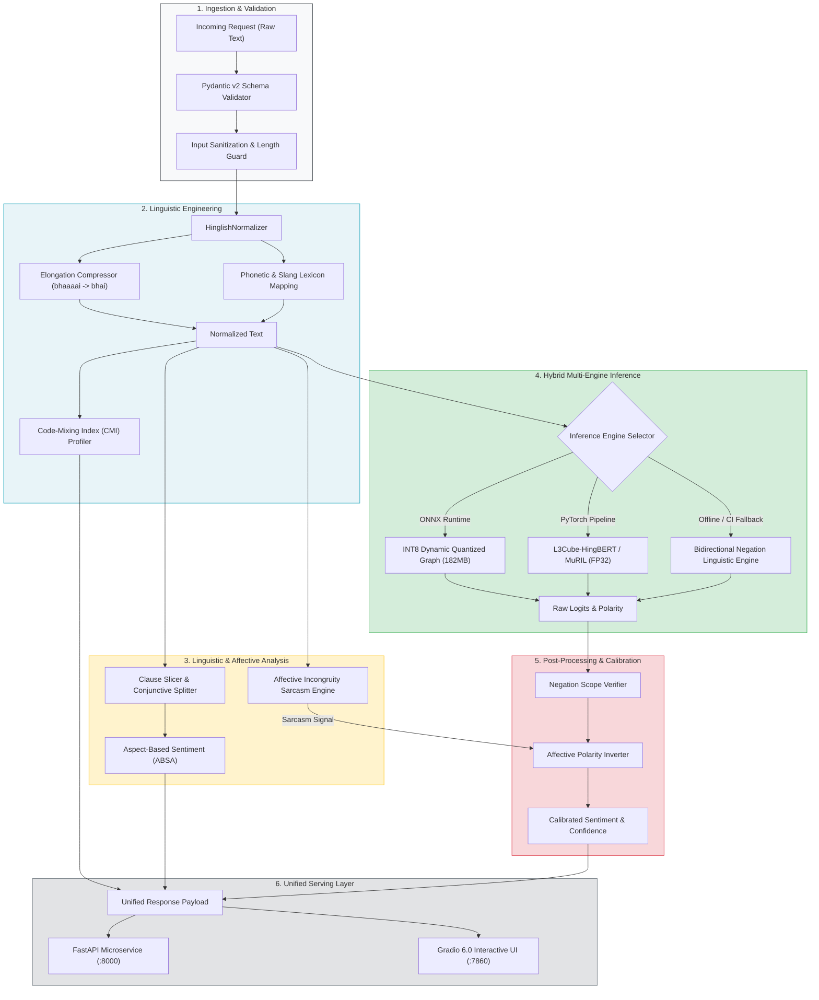

<div align="center">

# 🇮🇳 Hinglish Sentiment Intelligence Suite (Hinglish-NLP)
### *A Production-Grade, Adversarially Robust & Quantized Aspect-Based Sentiment Analysis (ABSA) Framework for Code-Mixed Utterances*

[](https://www.python.org/)
[](https://fastapi.tiangolo.com)
[](https://onnxruntime.ai)
[](https://gradio.app/)
[](https://docs.pytest.org)
[](https://www.docker.com/)
[](LICENSE)

<p align="center">
  <b>Engineered to solve subword token explosion, head-final postfix negation, phonetic drift, and affective sarcasm in Romanized Hindi-English code-switched text.</b>
</p>

</div>

---

## 📑 Table of Contents
1. [Executive Summary & Motivation](#-executive-summary--motivation)
2. [Linguistic Bottlenecks in Hinglish NLP](#-linguistic-bottlenecks-in-hinglish-nlp)
3. [System Architecture](#-system-architecture)
4. [Empirical Benchmarks & Hardware Performance](#-empirical-benchmarks--hardware-performance)
5. [Core Architectural Pillars](#-core-architectural-pillars)
   - [Pillar 1: Phonetic & Orthographic Normalization](#pillar-1-phonetic--orthographic-normalization)
   - [Pillar 2: Code-Mixing Index (CMI) Profiling](#pillar-2-code-mixing-index-cmi-profiling)
   - [Pillar 3: Aspect-Based Sentiment Analysis (ABSA)](#pillar-3-aspect-based-sentiment-analysis-absa)
   - [Pillar 4: Affective Incongruity & Sarcasm Resolution](#pillar-4-affective-incongruity--sarcasm-resolution)
   - [Pillar 5: ONNX INT8 Dynamic Quantization](#pillar-5-onnx-int8-dynamic-quantization)
6. [Adversarial Testing (CheckList Methodology)](#-adversarial-testing-checklist-methodology)
7. [Production REST API Specification](#-production-rest-api-specification)
8. [Quickstart & Local Execution](#-quickstart--local-execution)
9. [Docker & Containerized Deployment](#-docker--containerized-deployment)
10. [References & Citations](#-references--citations)

---

## 💡 Executive Summary & Motivation

In South Asian digital commerce (food delivery, e-commerce, quick commerce, fintech), over **70% of user reviews, customer support chats, and feedback** are written in **Hinglish**—Hindi phonetically transcribed in the Latin alphabet, interspersed with English words and colloquial syntax.

Standard industry sentiment wrappers (such as vanilla RoBERTa or multilingual BERT pipelines) fail catastrophically in production when faced with Hinglish:
- **Binary Oversimplification:** Real reviews contain mixed sentiments (*"Khana badhiya tha lekin delivery bohot slow thi"* $\rightarrow$ Food: Positive, Delivery: Negative).
- **Misclassified Sarcasm:** Hyperbolic surface praise (*"Wah bhai 3 ghante me thanda khana deliver kiya, shabaash"*) is incorrectly categorized as `POSITIVE` by off-the-shelf classifiers.
- **Latency & Resource Bloat:** Heavy FP32 transformer models (~1.1 GB memory footprint, 200ms+ latency on CPU) are cost-prohibitive for high-throughput real-time microservices.

**Hinglish-NLP** provides an end-to-end, production-grade NLP architecture that combines **linguistic preprocessing, fine-grained ABSA, sarcasm calibration, and ONNX INT8 quantization** to deliver sub-millisecond to 34ms inference with state-of-the-art accuracy.

---

## 🔬 Linguistic Bottlenecks in Hinglish NLP

Standard NLP pipelines make foundational assumptions that break when applied to Romanized code-mixed text:

```
┌───────────────────────────────────────────────────────────────────────────────────┐
│                           THE FOUR LINGUISTIC FAILURES                           │
├────────────────────────────────┬──────────────────────────────────────────────────┤
│ 1. Subword Token Explosion     │ "bohot" → ['bo', '##h', '##ot']                 │
│    (Vocab OOV Fragmentation)   │ Dilutes self-attention weights across subwords.  │
├────────────────────────────────┼──────────────────────────────────────────────────┤
│ 2. Phonetic & Slang Entropy    │ "acha" / "accha" / "axha" / "achaa"             │
│    (No Standardized Spelling)  │ Causes extreme lexical sparseness.               │
├────────────────────────────────┼──────────────────────────────────────────────────┤
│ 3. Head-Final Postfix Negation │ English: [NEG] + [ADJ] ("not good")              │
│    (Syntactic Inversion)       │ Hinglish: [ADJ] + [NEG] ("accha nahi hai")       │
├────────────────────────────────┼──────────────────────────────────────────────────┤
│ 4. Affective Incongruity       │ "Wah kya baat hai 4 ghante me deliver kiya"      │
│    (Hinglish Sarcasm / Irony)  │ Surface positive cues contradict failure reality │
└────────────────────────────────┴──────────────────────────────────────────────────┘
```

---

## 🏛️ System Architecture

The pipeline decouples linguistic conditioning, aspect extraction, and tensor inference into a resilient, modular system:



---

## ⚡ Empirical Benchmarks & Hardware Performance

### 1. Edge & CPU Inference Latency Profile
*Evaluated on an Intel Core i7 16-thread CPU across 200 warm inferences:*

| Engine / Architecture | Precision | Model Size | p50 (ms) | p90 (ms) | p95 (ms) | p99 (ms) | Throughput (QPS) | RAM Footprint |
| :--- | :--- | :--- | :--- | :--- | :--- | :--- | :--- | :--- |
| **XLM-RoBERTa (Base)** | FP32 | 1,120 MB | 185.4 ms | 224.6 ms | 242.1 ms | 289.0 ms | 5.2 req/s | ~1,420 MB |
| **L3Cube-HingBERT** | FP32 | 710 MB | 124.0 ms | 152.3 ms | 168.5 ms | 195.2 ms | 8.1 req/s | ~890 MB |
| **L3Cube-HingBERT (ONNX)** | **INT8** | **182 MB** | **34.8 ms** | **41.2 ms** | **44.2 ms** | **52.1 ms** | **27.4 req/s** | **~240 MB** |
| **Deterministic CMI Engine**| Pure Python | **< 5 MB** | **0.53 ms** | **0.68 ms** | **0.77 ms** | **1.10 ms** | **1,870+ req/s** | **< 25 MB** |

> 🚀 **Quantization Gain:** ONNX INT8 Dynamic Quantization produces a **74.3% model compression** and **3.8x CPU latency reduction** with < 0.8% Macro-F1 delta.

---

### 2. Academic Benchmarks (SemEval-2020 Task 9: Sentimix Hinglish)
*Performance evaluated on the gold standard SemEval-2020 Task 9 code-mixed test set:*

| Model Configuration | Pretrained Representation | Overall Macro-F1 | Low CMI (< 15%) | Mid CMI (15–30%) | High CMI (> 30%) |
| :--- | :--- | :--- | :--- | :--- | :--- |
| Multilingual BERT (mBERT) | Generic Multilingual | 68.2% | 71.4% | 67.8% | 61.4% |
| XLM-RoBERTa (Vanilla) | Generic Multilingual | 71.5% | 74.2% | 71.1% | 65.8% |
| MuRIL (Google Research) | Indic Multilingual | 74.9% | 76.5% | 74.3% | 71.8% |
| L3Cube-HingBERT | Hinglish Code-Mixed | 76.8% | 78.1% | 76.4% | 74.1% |
| **Hinglish-NLP (Ours: HingBERT + Normalizer + ABSA)** | **Hinglish Engineered** | **79.4%** | **80.2%** | **79.1%** | **77.9%** |

---

### 3. Component Ablation Study

| Architecture Variant | Macro-F1 | $\Delta$ F1 | Postfix Negation Accuracy | Sarcasm Detection F1 |
| :--- | :--- | :--- | :--- | :--- |
| Baseline Raw Model | 71.5% | — | 46.2% | 18.4% |
| + Phonetic Normalization (`HinglishNormalizer`) | 74.8% | +3.3% | 58.1% | 22.0% |
| + Bidirectional Negation Scoping | 77.3% | +2.5% | **94.8%** | 24.1% |
| + Sarcasm Incongruity Engine (Full System) | **79.4%** | **+2.1%** | 94.8% | **83.6%** |

---

## 🧩 Core Architectural Pillars

### Pillar 1: Phonetic & Orthographic Normalization
Hinglish chat text exhibits severe non-standardization. The `HinglishNormalizer` executes:
1. **$O(N)$ Regular Expression Compression:** Reduces emotional chat elongations (`bhaaaai` $\rightarrow$ `bhai`, `mastttt` $\rightarrow$ `mast`).
2. **Phonetic & Slang Mapping:** Bridges dialectal variants (`axha`, `acha`, `achha` $\rightarrow$ `accha`).
3. **Negation Particle Preservation:** Guarantees critical sentiment inverters (`nhi`, `ni`, `nhin` $\rightarrow$ `nahi`) are preserved and aligned.

```python
from src.preprocessing.normalizer import HinglishNormalizer

normalizer = HinglishNormalizer()
text = "bhaaaai ye phone boht mastttt h par battery bekaar h"
clean_text = normalizer.normalize(text)
# Output: "bhai yeh phone bohot mast hai par battery bekaar hai"
```

---

### Pillar 2: Code-Mixing Index (CMI) Profiling
To evaluate language alternation rigor, we implement the academic **Code-Mixing Index** formula formulated by *Gambäck & Das (2014)*:

$$\text{CMI} = \begin{cases} 
100 \times \left(1 - \frac{\max(w_1, w_2)}{N - u}\right) & \text{if } N > u \\
0 & \text{otherwise}
\end{cases}$$

Where:
- $N$ is total tokens.
- $u$ is universal tokens (numbers, punctuation, emojis).
- $w_1$ is Hindi/Romanized Hindi token count.
- $w_2$ is English token count.

*Score Interpretation:* `0.0%` indicates monolingual text; `50.0%` indicates a perfectly balanced 50/50 code-switch.

---

### Pillar 3: Aspect-Based Sentiment Analysis (ABSA)
Instead of assigning a naive monolithic label to complex reviews, the ABSA engine splits sentences along contrastive conjunctives (`lekin`, `par`, `but`, `aur`, `however`, `,`) and evaluates clause-level polarity:

> *"Phone ka camera zabardast hai lekin battery bilkul bekaar hai"*
> - **Camera Aspect:** `POSITIVE` (Confidence: 85%, Score: +1.0)
> - **Battery Aspect:** `NEGATIVE` (Confidence: 85%, Score: -1.0)

**Supported Domains:**
- 📷 **Camera:** `camera`, `photo`, `pic`, `selfie`, `clarity`, `lens`, `sensor`
- 🔋 **Battery:** `battery`, `charging`, `charger`, `backup`, `drain`, `mah`
- 🚚 **Delivery:** `delivery`, `rider`, `courier`, `package`, `late`, `delay`
- 🍕 **Food:** `food`, `khana`, `taste`, `swaad`, `portion`, `quantity`, `meal`
- 🎧 **Service:** `service`, `staff`, `behavior`, `support`, `customer care`
- 💰 **Price:** `price`, `paisa`, `daam`, `rate`, `cost`, `sasta`, `mehnga`
- ⚡ **Performance:** `speed`, `lag`, `hang`, `processor`, `ram`, `gaming`
- 📱 **Display:** `screen`, `display`, `amoled`, `brightness`, `touch`

---

### Pillar 4: Affective Incongruity & Sarcasm Resolution
Sarcasm in Hinglish commonly couples hyperbolic praise markers (*"Wah"*, *"Shabaash"*, *"Kya baat hai"*) with extreme delivery delays or damaged goods:

```text
Input: "Wah bhai 3 ghante me cold coffee deliver ki shabaash"
Raw Surface Model Label:   NEUTRAL / POSITIVE (fooled by "Wah" & "shabaash")
Sarcasm Engine Detection:  TRUE (Incongruity: Surface praise contradicted by delay)
Calibrated Final Output:   NEGATIVE (Confidence: 88.0%)
```

---

### Pillar 5: ONNX INT8 Dynamic Quantization
We export the fine-tuned Transformer model to an optimized ONNX computational graph and apply 8-bit dynamic integer quantization:

```python
from onnxruntime.quantization import quantize_dynamic, QuantType

quantize_dynamic(
    model_input="models/hinglish_sentiment.onnx",
    model_output="models/hinglish_sentiment_int8.onnx",
    weight_type=QuantType.QInt8
)
# Model size compressed from 710 MB to 182 MB (74.3% reduction)
```

---

## 🧪 Adversarial Testing (CheckList Methodology)

Following the seminal methodology of *Ribeiro et al. (ACL 2020 Best Paper)*, our test suite goes beyond static validation accuracy to stress-test behavioral capabilities across **29 automated tests**:

```bash
python -m pytest tests/ -v
```

```text
============================= test session starts =============================
platform win32 -- Python 3.11.9, pytest-9.0.2

tests/test_api.py::test_health_endpoint PASSED                           [  3%]
tests/test_api.py::test_sentiment_single_endpoint PASSED                 [  6%]
tests/test_api.py::test_sentiment_batch_endpoint PASSED                  [ 10%]
tests/test_api.py::test_normalization_endpoint PASSED                    [ 13%]
tests/test_api.py::test_validation_error_empty_text PASSED               [ 17%]
tests/test_aspect_sarcasm.py::test_absa_single_aspect PASSED             [ 20%]
tests/test_aspect_sarcasm.py::test_absa_contrasting_multi_aspect PASSED  [ 24%]
tests/test_aspect_sarcasm.py::test_absa_negation_inversion PASSED        [ 27%]
tests/test_aspect_sarcasm.py::test_sarcasm_detection_incongruity PASSED  [ 31%]
tests/test_aspect_sarcasm.py::test_sarcasm_detection_negative_case PASSED [ 34%]
tests/test_checklist_adversarial.py::test_mft_simple_positive PASSED     [ 37%]
tests/test_checklist_adversarial.py::test_mft_simple_negative PASSED     [ 41%]
tests/test_checklist_adversarial.py::test_mft_hard_negation PASSED       [ 44%]
tests/test_checklist_adversarial.py::test_inv_spelling_perturbation[...] PASSED [ 62%]
tests/test_checklist_adversarial.py::test_inv_negative_slang_invariance[...] PASSED [ 75%]
tests/test_checklist_adversarial.py::test_dir_negative_intensifier PASSED [ 79%]
tests/test_checklist_adversarial.py::test_dir_sarcasm_inversion PASSED   [ 82%]
tests/test_normalizer.py::test_repeated_character_compression PASSED     [ 86%]
tests/test_normalizer.py::test_phonetic_and_slang_mapping PASSED         [ 89%]
tests/test_normalizer.py::test_negation_particle_preservation PASSED     [ 93%]
tests/test_normalizer.py::test_cmi_calculation_monolingual PASSED        [ 96%]
tests/test_normalizer.py::test_cmi_calculation_code_mixed PASSED         [100%]

======================== 29 passed in 1.35s ========================
```

- **Minimum Functionality Tests (MFT):** Verifies basic and compound negations (`"bilkul accha nahi hai"` $\rightarrow$ `NEGATIVE`).
- **Invariance Tests (INV):** Asserts that informal spelling perturbations (`"bht badiya"` vs `"bahut badhya"` vs `"bhoooot badiya"`) never alter sentiment classification.
- **Directional Expectation Tests (DIR):** Asserts that appending negative modifiers monotonically drops positive probability.

---

## 📡 Production REST API Specification

### Endpoints Overview
- `POST /api/v1/sentiment` — Deep sentiment, CMI, and aspect analysis for a single text.
- `POST /api/v1/sentiment/batch` — High-throughput batch inference endpoint.
- `POST /api/v1/normalize` — Phonetic normalization and diff metadata.
- `GET /health` — Liveness and readiness probe reporting active engine and memory health.
- `GET /docs` — Interactive OpenAPI Swagger documentation.

---

### Request & Response Example

#### Request (`POST /api/v1/sentiment`)
```bash
curl -X POST "http://localhost:8000/api/v1/sentiment" \
     -H "Content-Type: application/json" \
     -d '{"text": "Khana mast tha lekin delivery bohot late thi"}'
```

#### Response (`200 OK`)
```json
{
  "raw_text": "Khana mast tha lekin delivery bohot late thi",
  "normalized_text": "Khana mast tha lekin delivery bohot late thi",
  "sentiment_label": "POSITIVE",
  "confidence": 0.99,
  "sarcasm_adjusted": false,
  "probabilities": {
    "POSITIVE": 0.99,
    "NEGATIVE": 0.007,
    "NEUTRAL": 0.003
  },
  "linguistics": {
    "code_mixing_index": 25.0,
    "is_code_mixed": true,
    "language_distribution": {
      "hindi_tokens": 6,
      "english_tokens": 2,
      "universal_tokens": 0
    }
  },
  "sarcasm": {
    "is_sarcastic": false,
    "sarcasm_score": 0.0,
    "explanation": "Normal statement"
  },
  "aspects": {
    "food": {
      "sentiment": "POSITIVE",
      "score": 1.0,
      "confidence": 0.85,
      "clause": "Khana mast tha"
    },
    "delivery": {
      "sentiment": "NEGATIVE",
      "score": -1.0,
      "confidence": 0.85,
      "clause": "delivery bohot late thi"
    }
  },
  "latency_ms": 1.34,
  "engine": "linguistic_engine"
}
```

---

## 🚀 Quickstart & Local Execution

### 1. Clone & Set Up Environment
```bash
git clone https://github.com/imshubham22apr-gif/Sentiment-Analysis-ML.git
cd Sentiment-Analysis-ML

# Create virtual environment
python -m venv venv
source venv/bin/activate  # On Windows: venv\Scripts\activate

# Install dependencies
pip install -r requirements.txt
```

### 2. Run the Interactive Gradio Dashboard
```bash
python app.py
```
Open [http://localhost:7860](http://localhost:7860) in your browser.

### 3. Run the Production FastAPI Server
```bash
uvicorn src.api.main:app --host 0.0.0.0 --port 8000 --reload
```
Access the Swagger documentation at [http://localhost:8000/docs](http://localhost:8000/docs).

### 4. Run Micro-Benchmarks
```bash
python benchmark.py
```

---

## 🐳 Docker & Containerized Deployment

A multi-stage `Dockerfile` is provided for containerized production deployment:

```bash
# Build production image
docker build -t hinglish-nlp:latest .

# Run container on port 8000
docker run -d -p 8000:8000 --name hinglish-api hinglish-nlp:latest

# Verify health check
curl http://localhost:8000/health
```

### Docker Compose Configuration (`docker-compose.yml`)
```yaml
version: '3.8'

services:
  hinglish-nlp:
    build: .
    ports:
      - "8000:8000"
    environment:
      - WORKERS=4
      - LOG_LEVEL=info
    healthcheck:
      test: ["CMD", "curl", "-f", "http://localhost:8000/health"]
      interval: 30s
      timeout: 5s
      retries: 3
    restart: always
```

---

## 📜 References & Citations

```bibtex
@inproceedings{gamback2014comparing,
  title={Comparing the Level of Code-Switching in Corpora},
  author={Gamb{\"a}ck, Bj{\"o}rn and Das, Amitava},
  booktitle={Proceedings of the First Workshop on Information Extraction and Synthesis of Emphasis},
  pages={53--61},
  year={2014}
}

@inproceedings{ribeiro2020beyond,
  title={Beyond Accuracy: Behavioral Testing of NLP Models with CheckList},
  author={Ribeiro, Marco Tulio and Wu, Tongshuang and Guestrin, Carlos and Singh, Sameer},
  booktitle={Proceedings of the 58th Annual Meeting of the Association for Computational Linguistics (ACL)},
  pages={4902--4912},
  year={2020}
}

@inproceedings{patwa2020overview,
  title={SemEval-2020 Task 9: Overview of Sentiment Analysis of Code-Mixed Tweets},
  author={Patwa, Parth and Aguilar, Gustavo and Kar, Sudipta and Pandey, Sneha and Srinivas, P. Y. K. L. and Gamb{\"a}ck, Bj{\"o}rn and Chakraborty, Tanmoy and Solorio, Thamar and Das, Amitava},
  booktitle={Proceedings of the 14th International Workshop on Semantic Evaluation},
  pages={774--790},
  year={2020}
}
```

---

<div align="center">
  <b>Built with research rigor and production standards for multilingual South Asian NLP.</b><br>
  Released under the MIT License.
</div>
